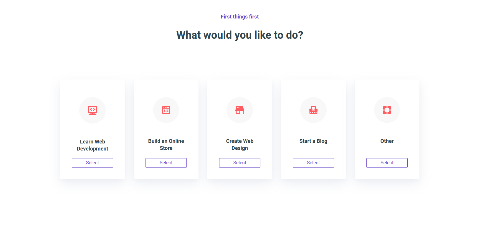
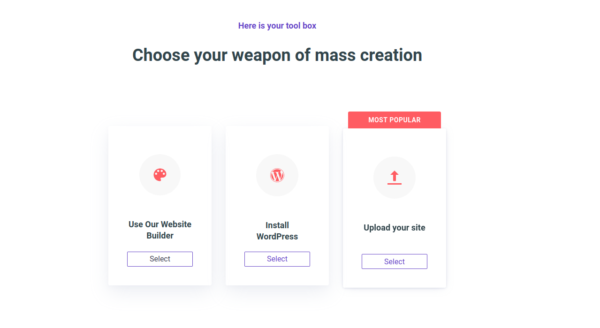
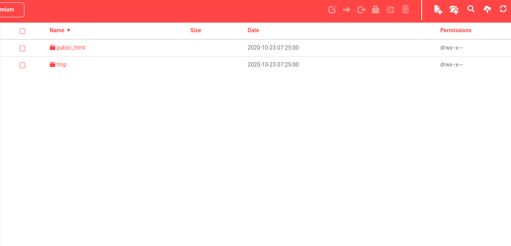
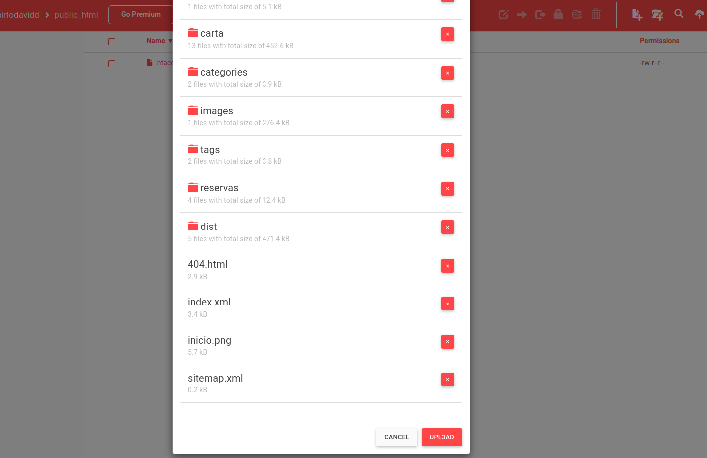
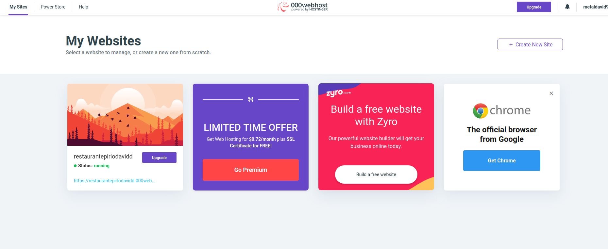

  **1.-Apache en un servidor**

  Si quisieramos hacer esto en un servidor, o unico que tendriamos que hacer es instalar el seguir los pasos anteriores pero en el servidor y una vez esta configurado el apache en el servidor solo hariamos un rsync de nuestra maquina al servidor:

  **rsync -avh --progress Rutadelproyecto usuario@IPservidor:/var/www/html**

  Y ya lo tendriamos.

  **1.1 Meter contenido en un host gratuito** 

  Ingresaremos en la pagina "00WebHost.com", nos crearemos una cuenta y despues elegiremos la opcion:

  **seleccionamos la opcion "other".**

  **Ahora nos dira que elijamos un nombre y una contraseña.**

  

**Y le damos click en submit.**

  

  **Y elegimos la opcion "upload a file"**

  

**se nos abrira  esta ventana y accederemos a la carpeta "public_html"**

**Dentro de esta meteremos los archivos de dentro de la carpeta public**

  

**Y le daremos a "upload"**

**Volveremos a la pagina 00WebHost.com y veremos que sale nuestra pagina activa en la izquierda"**

 

**Entramos en el link que nos indicia donde esta nuestra pagina y confirmamos que funciona**

   

