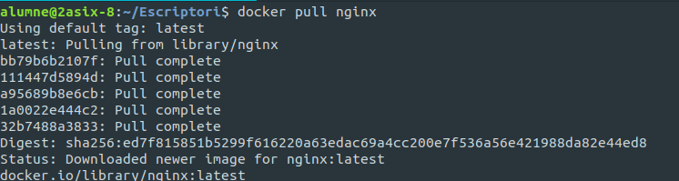
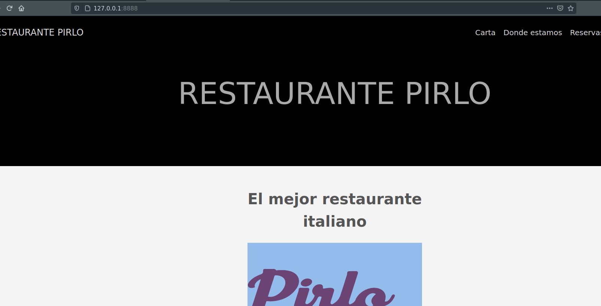

#	**MEMORIA WEB DOCKER -- DAVID PÉREZ**
	
	
	
	
#	**1.- Instalación DOCKER.**

   - Instalamos el nginx si no lo tenemos instalado con el siguiente comando:

  **docker pull nginx**

  
      
       
#    **2.- Configuracion de nginx/public**

    - Pondremos el siguiente comando para crear nuestro servidor:
    
		1 $ docker run -d -p 8888:80 --name restaurant -v /home/alumne/Webrestaurant/restaurant/public:/usr/share/nginx/html:ro nginx

    Donde en "/home/alumne/Webrestaurant/restaurant/public" sera la ruta donde tengamos el public generado y "/usr/share/nginx/html" sera la ruta donde nginx tiene su Documentroot"

        Y le damos a intro

  
  **Ahora accedemos a la dirección "127.0.0.1:8888" que es la que hemos puesto a la hora de configurar el nginx y vemos que tenemos nuestra pagina en funcionamiento**

  